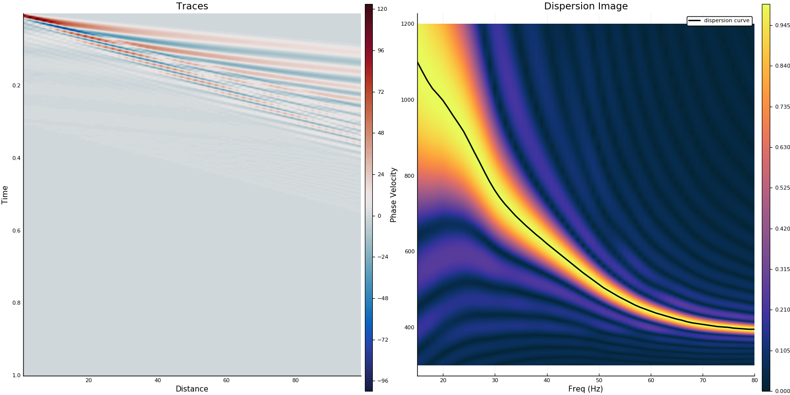

# MASW

## Julia script for Multichannel Analysis of Surface Waves (MASW)

#### Reference:
> Park, C.B., Miller, R.D. and Xia, J., 1999. Multichannel analysis of surface waves. Geophysics, 64(3), pp.800-808. doi.org/10.1190/1.1444590

This is the translation in Julia based on [matlab script written by John Schuh](https://www.mathworks.com/matlabcentral/fileexchange/65138-masw-dispersion-curve).

Matlab script: Copyright (c) 2018, John Schuh All rights reserved.

THIS SOFTWARE IS PROVIDED BY THE COPYRIGHT HOLDERS AND CONTRIBUTORS "AS IS"
AND ANY EXPRESS OR IMPLIED WARRANTIES, INCLUDING, BUT NOT LIMITED TO, THE
IMPLIED WARRANTIES OF MERCHANTABILITY AND FITNESS FOR A PARTICULAR PURPOSE ARE
DISCLAIMED. IN NO EVENT SHALL THE COPYRIGHT OWNER OR CONTRIBUTORS BE LIABLE
FOR ANY DIRECT, INDIRECT, INCIDENTAL, SPECIAL, EXEMPLARY, OR CONSEQUENTIAL
DAMAGES (INCLUDING, BUT NOT LIMITED TO, PROCUREMENT OF SUBSTITUTE GOODS OR
SERVICES; LOSS OF USE, DATA, OR PROFITS; OR BUSINESS INTERRUPTION) HOWEVER
CAUSED AND ON ANY THEORY OF LIABILITY, WHETHER IN CONTRACT, STRICT LIABILITY,
OR TORT (INCLUDING NEGLIGENCE OR OTHERWISE) ARISING IN ANY WAY OUT OF THE USE
OF THIS SOFTWARE, EVEN IF ADVISED OF THE POSSIBILITY OF SUCH DAMAGE.

- John Schuh (2020). MASW Dispersion Curve (https://www.mathworks.com/matlabcentral/fileexchange/65138-masw-dispersion-curve), MATLAB Central File Exchange. Retrieved January 14, 2020.

Example is available in `example` directory. (Tip: usually found in `$HOME/.julia/packages/MASW/`)

---
    masw(U::AbstractArray, x::AbstractArray, t::AbstractArray, ct::AbstractArray;
               plotfreqlimits::Tuple=(),
               plotwaterlevel::Real=0.0,
               figdir::String="",
               figname::String="")

Return dispersion curve inferred from Multichannel Analysis of Surface Waves (MASW)

## Arguments
- `U::AbstractArray`: 2D Array for seismci traces: size(U)=(T:length of timeseries, N:number of traces)
- `x::AbstractArray`: Vector for offsets (distance between source and receiver)
- `t::AbstractArray`: Vector for timeseries (ex. 0:1/fs:Tmax)
- `ct::AbstractArray`: Vector for scanning velocity of interest.
- `plotfreqlimits::Tuple=()`: Tuple for minfreq and maxfreq of plotting (ex. (0.0, 10.0))
- `plotwaterlevel::Real=0.0`: Dispersion Image waterlevel expressed as a percent for display purposes.
- `figdir::String=""`: Figure directory name if you want to plot the result figure.
- `figname::String=""`: figname if you want to plot the result figure (please include extention.).

## Usage

`(f, ct, Udisp, DispersionCurve) = masw(U, x, t, ct, plotfreqlimits, plotwaterlevel, figdir, figname)`

## Output

- `f`: Vector for frequency associated with dispersion image.
- `ct`: Vector for scanning velocity associated with dispersion image.
- `Udisp`: Normalized 2D array for dispersion image.
- `DispersionCurve`: DispersionCurve including frequency and automatically picked phase velocity.

---